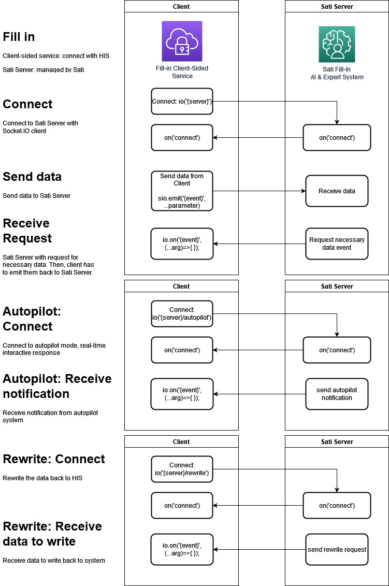

# Standard input format for Fill in

## Data flows in Fill in


### Communication protocol
Fill in uses [Socket.IO](https://socket.io) to handling HTTP and WebSocket connection.

### Namespace
In Socket.IO, [namespace](https://socket.io/docs/v4/namespaces) is virtual path to split the communication into separated channels.  
  
#### The namespaces of Sati Server  
  
| Namespace    | name      | Description                                                                              |
| ------------ | --------- | ---------------------------------------------------------------------------------------- |
| `/`          | main      | main channels for client to send data to Sati Server, and receive important data request |
| `/autopilot` | autopilot | autopilot mode (enable for some client): real-time notification to user of HIS           |
| `/rewrite`   | rewrite   | write data back to client after authorized medical coders of client approves the data    |

### Domain name and path
Sati Fill in Server: [`https://fill-in.sati.co.th`](https://fill-in.sati.co.th)  

URL and Path should be set in connection option.  
```JS
const socket = io('https://fill-in.sati.co.th/{namespace}', {
  transports: ["websocket", "polling"], // use WebSocket first, if available
  path: "{path}"
})
```
  
For example  
```JS
const socket = io('https://fill-in.sati.co.th/rewrite', {
  transports: ["websocket", "polling"], // use WebSocket first, if available
  path: "/hn-txn"
})
```

#### Path  
| path      | Detail                              | Documentation          |
| --------- | ----------------------------------- | ---------------------- |
| `/hn-txn` | Patient and Transaction data        | [hn-txn.md](hn-txn.md) |
| `/code`   | Standard coding, e.g. ICD-10, ICD-9 | [code.md](code.md)     |

## Documentation

* [Patient &amp; Transaction data](hn-txn.md)
  * [Care Coverage](care-coverage.md)
* [Standard coding](icd.md)
* [Investigation](investigation.md)
  * [Laboratory and pahtology study](lab.md)
  * [Imaging study](imaging.md)
  * Special test
* [Medication, Equipment and Procedure](medication-equipment.md)
* Electronic Medical Record Data
* [Special Record](hn-txn.md#register-deregister-to-special-records) e.g. NCDs record, Well-baby clinic
  * [List of special record abbreviation](special-record.md)